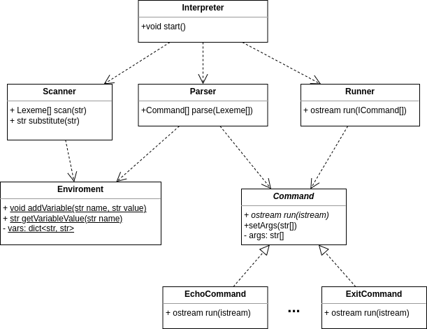

# SDICLI

Структурная диаграмма: [link](https://drive.google.com/file/d/1oOyFDbzb-k4jFylwcKNzB57CGmUAdjKh/view?usp=sharing)

## Общее описание системы

Основной класс Interpreter считывает команды, которые вводит пользователь. 

Считанную команду он передает Scanner'у, который выполняет подстановку, а затем разбивает эту строку на лексемы. 

Полученные лексемы передаются Parser'у, который анализирует их и формирует команды с их аргументами, либо создает переменную окружения. 

Сформированные команды передаются на выполнение Runner'у, который запускает их в порядке конвейера. Interpreter выводит пользователю результат выполнения Runner'а - вывод последней команды.

Также Interpreter занимается обработкой исключений, которые могут произойти во время выполнения команд.
В зависимости от состояния полей пойманного исключения класс или выводит сообщение об ошибке или завершает работу программы, с указанием кода возврата.

## Scanner
Анализирует текст исходной команды в два этапа
1. Первый проход сканера (метод *substitute*) модифицирует исходную строку  
 Выполняет подстановки переменных вида $x. Информация о содержимом переменных хранится в статическом классе окружения (*Enviroment*). Если переменной в окружении нет, то вместо нее будет подставлена пустая строка.   
Подстановки не выполняются, только если участок текста находится в одинарных кавычках (full quoting) на самом общем уровне вложенности (т.е. имеет вид \`...\`  и не находится внутри двойных кавычек).

2. Второй проход сканера (метод *scan*): разбиваем исходный текст запроса на лексемы. Возвращает список лексем, сохраняя их исходный порядок. Каждая лексема имеет свой тип. Лексемы типа *str* дополнительно хранят содержимое исходной строки. Анализ лексем достаточно простой, поэтому для определения их типа достаточно регулярных выражений.

### Лексемы
* *str* - строка произвольного формата. Объединяет символы, заключенные в двойные или ординарные скобки.  
* *id* является производной от *str*, определяет имя переменной в операции присваивания. Может содержать только цифры, буквы, нижнее подчеркивание и начинается не с цифры. 
* *assign* - знак равенства (=)
* *pipe* - знак вертикальной черты (|)

## Parser

Парсер преобразует набор лексем в команды по следующим правила (в порядке убывания приоритета)  
 * Если вторая от начала лексема - это *assign*: проверяем, чтобы первая была *id* (имя переменной), а третья - *str* (значение переменной). Если нет - ошибка операции присваивания.   
 Иначе парсер заносит имя переменной и ее значение в *Enviroment*. Все лексемы, стоящие после значения переменной, игнорируются.   

 * Если первая лексема *str* - она считается именем команды. Все лексемы после нее и до первого *pipe* считаем аргументами. Если лексемы закончились (или очередная лексема - это *pipe*) - создаем объект команды, соответствующий ее имени (класс *Command*) и передаем в нее выделенные аргументы (метод *setArgs*).  
 
 Для каждой из базовых команд (см. список ниже) существует своя имплементация *Command*. Для неизвестных команд - общая, которая сохраняет имя команды и список аргументов. Такие команды вызываются как внешние. Результат выполнения парсера - список объектов обнаруженных команд.

## Runner

Runner получает на вход список команд. Все команды реализуют одинаковый интерфейс. Все команды имеют в качестве поля список аргументов и имеют
метод run. Метод run принимает абстрактный ридер (далее - входящий ридер) и возвращает абстрактный ридер (далее - исходящий ридер), 
чтобы можно было строить цепочки. Также этот метод декларирует то что он выбрасывает исключение.

Runner запускает первую команду и передает ей в качестве входящего ридера null. Первая команда не читает информацию из стандартного
потока входа, поэтому null обозначает что команда выполняется первой. Полученный в результате выполнения первой команды исходящий ридер
передается в качестве входящего ридера для следующей команды. Таким образом Runner запускает выполнение всех команд последовательно.

Runner проверяет результат выполнения команды. Если полученный код возврата отличен от нуля, следующая команда запущена не будет.
В случае возникновения исключений во время выполнения команды, выполнение всех команд прекращается, объект исключения пробрасывается классу *Interpreter*.

После выполнения всех команд Runner возвращает классу Interpreter последний полученный исходящий ридер.

## Список базовых команд

Все команды реализуют общий интерфейс. Все команды реализуют логику работы в методе run. 
Команды могут использовать данные полученные через аргументы, а могут не использовать.
Команды могут использовать информацию из входящего ридера, а могут не использовать. Эти детали
зависят от реализации конкретной команды. Главное, что все команды возвращают исходящий ридер. Из этого ридера можно будет
считывать результаты работы команды.

### EchoCommand

Echo игнорирует все что поступило во входящем ридере. Выводит в исходящий ридер все свои аргументы через один пробел.

### CatCommand

Cat выводит содержимое файлов, которые указаны в аргументах в виде массива строк.
Строка является путем до искомого файла. Путь может быть как абсолютным, так и с началом в текущей рабочей директории.
Если файлы не указаны, тогда команда перенаправляет содержимое входящего ридера в исходящий ридер.

### WcCommand

Wc выводит количество строк, слов и байт в файлах, которые указаны в аргументах. 
Если файлы не указаны, тогда команда выводит количество строк, слов и байт в данных входящего ридера.
Значения выводятся в виде десятичного целого числа, через пробел.

### PwdCommand

Pwd выводит полный путь текущей директории. Игнорирует данные во входящем ридере и игнорирует аргументы.

### ExecuteCommand

Execute выполняет произвольную команду. На вход команде передаются аргументы. Стандартный поток входа читает данные из
входящего ридера, а стандартный поток вывода и стандартный поток ошибок записывают данные в исходящий ридер.

После выполнения команды обрабатывается ее код возврата. Если код возврата 0, тогда исполнение программы продолжается.
Если код возврата отличен от нуля, это значение сохраняется в поле, которое раннер может проверить.

### ExitCommand

Команда завершает работу интерпретатора. Команда выбрасывает исключение, со специальным полем, указывающим на то что необходимо
завершить работу. Интерпретатор, при обработке исключений, проверяет это поле и действует в соответствии с его
значением.

 ## Разделение на этапы
 * Первый проход сканера реализует только подстановку, без какой-либо дополнительной логики. Поэтому этот метод будет добавлен только на втором этапе без существенного изменения существующего кода.
 * В результате работы парсера на базовом этапе будем анализировать только первую команду, игнорируя лексемы после pipe. Итоговый список методов будет состоять из одного элемента.  
 * Механизмы определения потоков ввода/вывода у команд будут реализованы, но проинициализированы стандартными потоками. 

## Команда 
* Карагодин Дмитрий
* Бачище Ольга
* Шушаков Даниил