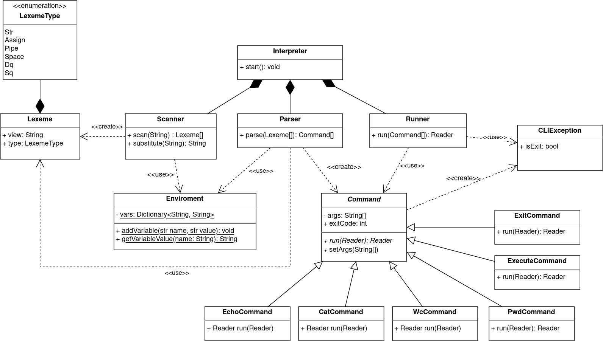

# SDICLI

Структурная диаграмма: [link](https://drive.google.com/file/d/1oOyFDbzb-k4jFylwcKNzB57CGmUAdjKh/view?usp=sharing)



## Общее описание системы

Основной класс Interpreter считывает команды, которые вводит пользователь. 

Считанную команду он передает Scanner'у, который выполняет подстановку, а затем разбивает эту строку на лексемы. 

Полученные лексемы передаются Parser'у, который анализирует их и формирует команды с их аргументами, либо создает переменную окружения. Допустимый ввод представляет из себя либо объявление переменной, либо вызов команды.

Сформированные команды передаются на выполнение Runner'у, который запускает их в порядке конвейера. Interpreter выводит пользователю результат выполнения Runner'а - вывод последней команды.

Также Interpreter занимается обработкой исключений, которые могут произойти во время выполнения команд.
В зависимости от состояния полей пойманного исключения класс либо выводит сообщение об ошибке, либо завершает работу программы, указывая кода возврата.

## Scanner
Разбивает текст исходной команды на лексемы с помощью регулярных выражений (метод *scan*). Возвращает список лексем, сохраняя их исходный порядок. Объект лексемы хранит ее вид (поле-перечисление *LexemeType*) и часть исходного текста (которому соответствует regex лексемы).

### Лексемы
* *space* - любая последовательность пробелов, табов и т.д
* *assign* - "="
* *pipe* - "|"
* *dq* - double quoted - любой текст в двойных кавычках
* *sq* - single quoted - любой текст в одинарных кавычках
* *str* - текст без *space*, *assign* и *pipe*, не в кавычках


### Регулярные выражения для выделения лексем
Анализ лексем простой, поэтому для определения их типа достаточно регулярных выражений. 

|Лемма | Регулярное выражение|
|---|---|
space |```[\s]+```
assign |```=```  
pipe| ```\\|```   
dq | ```"([^"]+)"```
sq | ```'([^']+)'```
str| ```[^=\\|\s'"]+```

Каждое регулярное выражение нужно обернуть в именованную группу. Искать каждую лемму строго с той позиции, где закончилась предыдущая. Если найти не удается, бросается исключение. 
## Parser
Получает на вход список лексем. 

Парсер выполняет следующие задачи:
1. Определяет объявление переменных и заносит их значение в *Environment*. 
2. Выполняет подстановку значений переменных (только в str и dq).
3. Определяет вызов команд, создает объект типа *Command* с именем и аргументами команды.

Результат работы парсера:
*  список вызванных команд с переданными в них аргументами, 
*  обновленный *Environment* со значениями объявленных переменных.

Для удобства формат анализа лексем представлен в нотации, схожей с regex.  

### 1. Объявление переменной    
Чтобы строка считалась объявление переменной, нужно, чтобы набор лексем начинался с 
`str, assign, ...`

Также нужно, чтобы `str` удовлетворяла ограничениям имени переменной (не начинается с цифры, содержит только буквы, цифры и `_`)

Регулярное выражение для имени переменной
```var = "([_A-Za-z][_A-Za-z0-9]*)```  

Если какое то правило нарушено, то считаем, что строка - вызов команды.

`cmd_name = var assign (^ space pipe)`
Если все хорошо, то str - имя переменной. Ее значением является конкатенация всех лексем справа от `assign`. Если среди этих лексем встречается `space` или `pipe`, бросается исключение. Перед склеиванием лексем, они проходят этап подстановки переменных.

> Пример конкатенации: исходная строка ```"aa""bb"``` будет распознана как две лексемы типа dq с содержимым ```"aa"``` и ```"bb"```, но конкатенированы в одно значение ```aabb```

Таким образом, объявление переменной соответствует формату:  
`decl_val = var assign (^ space pipe)+`

Парсер заносит имя переменной и ее значение в *Enviroment*. 

### 2. Вызов команды
* Имя команды - набор лексем, соответствующий формату   
```cmd_name = (str | dq | sq | assign)+```.    
Лексемы имени команды конкатенируют. 

* Аргументы команды - набор лексем, соответствующий формату   
```arg = (str | dq | sq | assign)+  ```.    
Лексемы аргумента конкатенируют. 
* Команда (или вызов команды) - набор лексем, соответствующий формату   
```cmd = cmd_name (space arg)+```

При обнаружении cmd парсер создает объект команды, соответствующий ее имени (класс *Command*) и передает в нее выделенные аргументы (метод *setArgs*).  

Для каждой из базовых команд (см. список ниже) существует своя имплементация *Command*. Для неизвестных команд - `ExecuteCommand`, которая сохраняет имя команды и список аргументов.  

### 3. Допустимый формат ввода
Таким образом, допустимый ввод можно представить в формате:    
```(decl_val | [<cmd>][<pipe><cmd>]+)*```

Если с помощью ```pipe``` указано несколько команд, то они сохраняются в списке с сохранением порядка (относительно порядка соответствующих лексем).

### 4. Подстановка переменных
Вызов переменной - это строка формата ```$<var>```.   
Подстановка переменной - замена вызова переменной на значение переменной с именем ```var```. Если переменной с таким именем нет, то подставляется пустая строка.   
Такая замена происходит в обычном тексте команды (```str```) или в лексеме текста в двойных кавычках (```dq```).   
Поэтому при анализе лексем ```str``` и ```dq``` выполняется поиск и подстановка переменных. Если при этом лексема `str` стала пустой, то мы ее выкидываем из списка лексем. 


## Runner

Runner получает на вход список команд. Все команды реализуют одинаковый интерфейс. Все команды имеют в качестве поля список аргументов и имеют
метод run. Метод run принимает абстрактный ридер (далее - входящий ридер) и возвращает абстрактный ридер (далее - исходящий ридер), 
чтобы можно было строить цепочки. Также этот метод декларирует то что он выбрасывает исключение.

Runner запускает первую команду и передает ей в качестве входящего ридера null. Первая команда не читает информацию из стандартного
потока входа, поэтому null обозначает что команда выполняется первой. Полученный в результате выполнения первой команды исходящий ридер
передается в качестве входящего ридера для следующей команды. Таким образом Runner запускает выполнение всех команд последовательно.

Runner проверяет результат выполнения команды. Если полученный код возврата отличен от нуля, следующая команда запущена не будет.
В случае возникновения исключений во время выполнения команды, выполнение всех команд прекращается, объект исключения пробрасывается классу *Interpreter*.

После выполнения всех команд Runner возвращает классу Interpreter последний полученный исходящий ридер.

## Список базовых команд

Все команды реализуют общий интерфейс. Все команды реализуют логику работы в методе run. 
Команды могут использовать данные полученные через аргументы, а могут не использовать.
Команды могут использовать информацию из входящего ридера, а могут не использовать. Эти детали зависят от реализации конкретной команды. Главное, что все команды возвращают исходящий ридер. Из этого ридера можно будет считывать результаты работы команды.

### EchoCommand

Echo игнорирует все что поступило во входящем ридере. Выводит в исходящий ридер все свои аргументы через один пробел.

### CatCommand

Cat выводит содержимое файлов, которые указаны в аргументах в виде массива строк.
Строка является путем до искомого файла. Путь может быть как абсолютным, так и с началом в текущей рабочей директории.
Если файлы не указаны, тогда команда перенаправляет содержимое входящего ридера в исходящий ридер.

### WcCommand

Wc выводит количество строк, слов и байт в файлах, которые указаны в аргументах. 
Если файлы не указаны, тогда команда выводит количество строк, слов и байт в данных входящего ридера.
Значения выводятся в виде десятичного целого числа, через пробел.

### PwdCommand

Pwd выводит полный путь текущей директории. Игнорирует данные во входящем ридере и игнорирует аргументы.

### ExecuteCommand

Execute выполняет произвольную команду. На вход команде передаются аргументы. Стандартный поток входа читает данные из
входящего ридера, а стандартный поток вывода и стандартный поток ошибок записывают данные в исходящий ридер.

После выполнения команды обрабатывается ее код возврата. Если код возврата 0, тогда исполнение программы продолжается.
Если код возврата отличен от нуля, это значение сохраняется в поле, которое раннер может проверить.

### ExitCommand

Команда завершает работу интерпретатора. Команда выбрасывает исключение, со специальным полем, указывающим на то что необходимо
завершить работу. Интерпретатор, при обработке исключений, проверяет это поле и действует в соответствии с его значением.

## Разделение реализации системы на 2 этапа
### Этап 1: реализация без подстановок и пайпов
* Дополнительный анализ содержимого строк (см. Парсер: Подстановка переменных) не реализован.
* При анализе вызова команд парсер учитывает лексемы только до первого ```pipe```, игнорируя оставшиеся. Итоговый список команд всегда состоит из одного элемента.  
* Runner запускает единственную команду, если она есть, с stdin и stdout в качестве потоков. 
* Вся остальная функциональность системы реализована согласно описанию.
###  Этап 2:  добавление в систему подстановок и пайпов
* При анализе лексем ```str``` и ```dq```  в парсере их содержимое проверяется на наличие `$<var>`. При обнаружении содержимое строки заменяется на значение переменной.
* При анализе команд с ```pipe```, все команды и аргументы анализируются и возвращаются в списке *Command* с сохранением порядка, указанного при вводе.
* Runner последовательно запускает команды, перенаправляя выходной поток предыдущей команды на вход следующей. 

## Сборка и запуск

Приложение поддерживает все платформы где реализована JVM. Для сборки необходим Maven 3.2+ и JDK 17+.

Для сборки и запуска
```
mvn clean package
java -jar .\target\sdicli.jar
```

Для запуска только тестов
```
mvn clean test
```

Для анализа покрытия кода тестами
```
mvn clean test
mvn jacoco:report -f pom.xml
# Открыть в браузере файл target/site/jacoco/index.html
```
Для запуска линтера и поиска багов
```
mvn clean verify
```

## Команда 
* Карагодин Дмитрий
* Бачище Ольга
* Шушаков Даниил